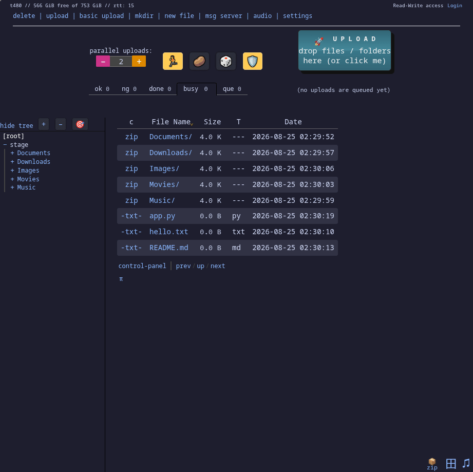
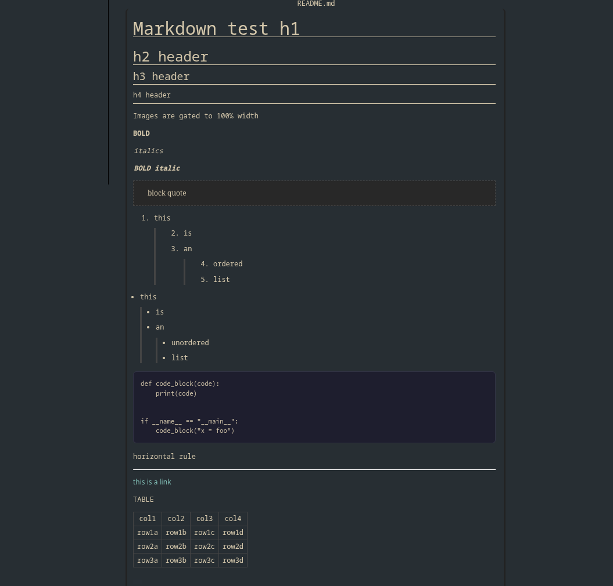

# sensible-copyparty-theme

## Summary

### Features
- Extremely Sensible Themes (TM)
- Easily add your own color schemes
- Ten Color Schemes out of the box
- Most importantly - NO EMOJIS!!!!! (mostly)

### Quickstart
It is so easy to get this up and running. 

1. Clone this repo to your machine
2. Update how you normally run copyparty with this flag: `--css-browser "/path/to/sensible-copyparty-theme/style.css?ce"`

__NOTE:__ Path must be in quotes, must start with `/` and must end with `?ce` 

__FURTHER NOTE:__ Copyparty does not like when you give an absolute path to the `--css-browser` argument. You would be better off storing the css in a path mounted in copyparty! Make sure it is stored in a mount available to everyone on your server. There has to be a better way...

### Change Themes
I wanted this as easy as possible. Just go into style.css, uncomment the theme that you want to use, comment out the other themes.

Feel free to add whatever theme you want. Create a pull request!

### Markdown Example:

### TODO:
- [x] Update markdown on main page to look normal
- [ ] update markdown to look good on subpages
- [ ] Reskin sub-pages
- [ ] eradicate remaining emojis

### Motivation
I love [copyparty](https://github.com/9001/copyparty). The uploads are fantastic and there is so much functionality for collaboration in the app. However, I have always disliked the UI. I use copyparty with a bunch of non-technical people and I got tired of having to walk them through the application, saying horrid sentences like "click on the rocketship". After using the app for a year or more, I got fed up and reskinned the UI one afternoon. That being said, this reskin is not perfect, but it will support 90% of your needs. 

Feel free to make a pull request with updates!

